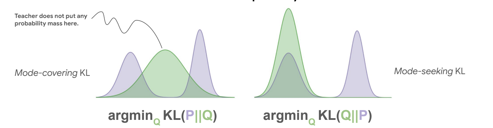

> "You do not truly understand something unless you implement it in [Andrej Karpathy's nanochat ⬈](https://github.com/karpathy/nanochat)." 
## On-Policy Distillation (OPD)
**A first-principles walkthrough + implementation inside nanochat**

---

A few weeks ago, On-Policy Distillation (OPD) took over the RL world with this excellent [Thinking machines blogpost ⬈](https://thinkingmachines.ai/blog/on-policy-distillation/). I thought the method was neat and effective, but I had a hard time understanding its connection to RL and just really, why it works in the first place. I decided the best way to grok it would be to see if I could implement the method myself. In the course of that, I went through all the math and intuition behind the method from first principles. It was really fun!

I've tried to jot down my thoughts exactly as I wish the method had been presented to me - starting from the basics and without skipping any steps. Hopefully this makes understanding the method and playing with it a lot easier!

__🔗 Quick Links__

* Code Repository: https://github.com/himsahni/nanochat

* [Model Files ⬈](https://drive.google.com/drive/folders/1IrqyiG09Kk5f-84nVokikJhJhJhMcrHd?usp=sharing)

* [W&B Dashboard ⬈](https://wandb.ai/himsahni-self/nanochat-rl/workspace?nw=nwuserhimsahni)

### OPD

In standard distillation methods, the teacher produces some output according to own model and the student simply learns to imitate it. In contrast, in On-Policy Distillation, the student’s own rollouts (its “on-policy” trajectories) are used to gather feedback from the teacher. This is really important as the smaller model may sometimes make mistakes and needs to learn how to recover from them. Think of learning how to drive a car. Regular distillation is like imitating an instructor's drives, it can only teach you what it looks when when everything's going well. On-policy distillation is like an instructor sitting next to you with one hand on the steering wheel, immediately correcting small mistakes and showing you how to recover from the most "shit hits the fan" moments. 

This technique was originally published for LLMs by [Rishabh Agarwal et al. in 2024 ⬈](https://arxiv.org/abs/2306.13649) at Google Deepmind. That is in turn closely related to the super popular RL/Robotics technique [DAGGER ⬈](https://arxiv.org/abs/1011.0686).

Ok so the intuition is fine, but how do we actually do it and why would it work any better than regular distillation? To understand this, we need to first adventure into the land of KL divergences.

### Forward vs. Reverse KL

In standard distillation you sample trajectories from the teacher (or have a pre-collected dataset) and the student tries to imitate it by minimizing:

$$
\begin{aligned}
\mathrm{CE}(t, s)
&= - \sum_y t(y) * \log s(y) \\
&= - \sum_y t(y) * \log t(y) + \sum_y t(y) * \log t(y) - \sum_y t(y) * \log s(y) \\
&= H(t) + \sum_y t(y) * (\log t(y) - \log s(y)) \\
&= H(t) + \mathrm{KL}(t\|s).
\end{aligned}
$$

For
* Teacher distribution: $t(⋅)$
* Student distribution: $s(⋅)$

Since $H(t)$ is constant, minimizing this objective is the same minimizing the forward KL $\mathrm{KL}(t\|s)$. This is really important and will help us understand a lot of things below. 

The key design choice in OPD is to minimize the reverse KL between the student and teacher instead. Let's look at this closely and see why this makes sense.

$$
\begin{align}
\mathrm{KL}(s\|t)
&=
\sum_y s(y)\bigl[\log s(y) - \log t(y)\bigr].
\end{align}
$$

Why is this a good idea? The behavior of these two objectives is different:

* Minimizing forward KL $KL(t\|s)$ is mode-covering: the student tries to put non-zero mass wherever the teacher has support (to avoid huge $−log s(.)$ penalties).

* Minimizing reverse KL $KL(s\|t)$ is mode-seeking: the student picks one (or a few) modes of the teacher and fits them well, ignoring others.

This is nicely visualized in the figure below from [Rishabh's slides ⬈](https://drive.google.com/file/d/1xMohjQcTmQuUd_OiZ3hB1r47WB1WM3Am/view)

Where Q is the learned distribution (student) and P is the fixed target (teacher). Since the student is smaller and under-parameterized compared to the teacher, letting it focus on a subset of modes and do them really well is preferable to spreading its capacity thinly across all modes of the teacher and doing all of them poorly. In the “driving” analogy, we want the student to learn one robust way to drive (and recover when it veers off), not every conceivable good style but with no guidance in the off-distribution parts.

### Token-level view and OPD-full

For LLMs, each sequence $y$ is a minibatch of examples, each example is a sequence of tokens, and at each time step $t$ we have a distribution over the vocabulary $V$.

The full reverse-KL objective (what I call opd-full) sums across the entire vocabulary at every token position:

$$
\begin{align}
\mathcal{L}_{\text{OPD-full}}
&=
\mathbb{E}_{x \sim s} \Bigg[
\frac{1}{|T|*|V|} \sum_{t \in T}
\sum_{i \in V}
s^i(x_t \mid x_{0:t-1})
\bigl(\log s^i(x_t \mid x_{0:t-1}) - \log t^i(x_t \mid x_{0:t-1})\bigr)
\Bigg].
\end{align}
$$

This is a perfectly valid way of doing OPD. But it involves computing the expectation explicitly over the entire vocab for each token. In practice, it is much more efficient to just use sampled tokens to estimate the reverse KL.

### Sample OPD and the connection to RL

The [Thinking machines's post ⬈](https://thinkingmachines.ai/blog/on-policy-distillation/) repeatedly compares OPD to RL, which can be a bit confusing. Strictly speaking OPD is not an RL algorithm. The student does not learn from environment feedback, it only learns from the teacher’s log-probs at states the student itself visits. 

With that being said, it turns out that if you massage the OPD objective a bit to compute KL over sampled tokens rather than the full vocabulary, its gradient turns out to look exactly like a standard REINFORCE policy-gradient update. You can plug that straight into your favorite RL library. It turns out, if you have a strong teacher available, this may be better than doing RL using the student model!

Start from the sequence-level reverse KL:

$$
\begin{align}
\mathcal{L}_{\text{OPD}}
&=
\mathrm{KL}(s_\theta\|t) \\
&=
\mathbb{E}_{y \sim s_\theta}
\bigl[\log s_\theta(y) - \log t(y)\bigr].
\end{align}
$$

negating and taking the derivative w.r.t to student model parameters:

$$
\begin{align}
\nabla_\theta \bigl(-\mathcal{L}_{\text{OPD}}\bigr)
&=
\nabla_\theta \mathbb{E}_{y \sim s_\theta}
\bigl[\log t(y) - \log s_\theta(y)\bigr] \\
&=
\nabla_\theta \sum_{y \sim s_\theta}
\bigl[s_\theta(y) * (\log t(y) - \log s_\theta(y))\bigr] 
\end{align}
$$

Let's define $A(y; \theta) = \log t(y) - \log s_\theta(y)$.

$$
\begin{align}
\nabla_\theta \bigl(-\mathcal{L}_{\text{OPD}}\bigr)
&=
\sum_{y \sim s_\theta}
\bigl[A(y; \theta) * \nabla_\theta s_\theta(y) + s_\theta(y) * \nabla_\theta A(y; \theta)\bigr].
\end{align}
$$

Since the teacher $t(.)$ is constant,

$$
\begin{align}
\nabla_\theta A(y; \theta) = - \nabla_\theta\log s_\theta(y). \\
\end{align}
$$

$$
\begin{align}
\nabla_\theta \bigl(-\mathcal{L}_{\text{OPD}}\bigr) = \sum_{y \sim s_\theta} 
\bigl[A(y; \theta) * \nabla_\theta s_\theta(y) - s_\theta(y) * \nabla_\theta\log s_\theta(y)\bigr].
\end{align}
$$

We know that $\nabla_\theta s_\theta(y) = s_\theta(y) *  \nabla_\theta \log s_\theta(y).$

Subsitituting that in both terms and splitting the sum:

$$
\begin{align}
\nabla_\theta \bigl(-\mathcal{L}_{\text{OPD}}\bigr)
&=
\bigl[\sum_{y \sim s_\theta} A(y; \theta) * s_\theta(y) * \nabla_\theta \log s_\theta(y)\bigr] - \bigl[\sum_{y \sim s_\theta} \nabla_\theta s_\theta(y)\bigr] \\
&=
\mathbb{E}_{y \sim s_\theta} \bigl[A(y; \theta) * \nabla_\theta \log s_\theta(y) \bigr] - \bigl[\sum_{y \sim s_\theta} \nabla_\theta s_\theta(y)\bigr].
\end{align}
$$

Let's look at the second term:

$$
\begin{align}
\sum_{y \sim s_\theta} \nabla_\theta s_\theta(y) &= \nabla_\theta \sum_{y \sim s_\theta} s_\theta(y) = \nabla_\theta 1 = 0.
\end{align}
$$

Therefore,

$$
\begin{align}
\nabla_\theta \bigl(-\mathcal{L}_{\text{OPD}}\bigr) = \mathbb{E}_{y \sim s_\theta}
\bigl[A(y; \theta) * \nabla_\theta \log s_\theta(y) \bigr].
\end{align}
$$

This looks exactly like the standard the REINFORCE form:

$$
\begin{align}
\nabla_\theta J
&=
\mathbb{E}\bigl[A_t * \nabla_\theta \log \pi_\theta(a_t \mid s_t)\bigr].
\end{align}
$$

with the advantage at each step defined as the log-probability gap between teacher and student. Good thing I used the letter A for that.

If the teacher likes a sampled token more than the student ($A(y; \theta) > 0$), the student’s probability for that token is increased. If the teacher likes it less ($A(y; \theta) < 0$), the student’s probability is decreased. This can be interpreted as the teacher providing dense, immediate rewards to the student at every step of the trajectory. Hence the connection to RL.

This is actually a very cool and deeply satisfying result to see from first principles! It also feels like we're just scratching the surface.

### Results

Below are the evaluation results comparing the baseline models, the SFT and RL checkpoints, and the OPD-trained student. GSM8K is the only task used for RL/OPD training (matching the setup in Karpathy’s repo). RL/OPD runs are evaluated at step 300.

| Metric        | BASE       | MID        | SFT        | RL         | OPD        | OPD FULL   | RL (D32)   |
|---------------|------------|------------|------------|------------|------------|------------|------------|
| CORE          | 0.2060     | -          | -          | -          | -          | -          | -          |
| ARC-Challenge | -          | 0.3234     | 0.2995     | -          | -          | -          | -          |
| ARC-Easy      | -          | 0.4154     | 0.4175     | -          | -          | -          | -          |
| GSM8K         | -          | 0.0409     | 0.0591     | 0.0766     | 0.1281     | 0.1425     | 0.1933     |
| HumanEval     | -          | 0.0915     | 0.0915     | -          | -          | -          | -          |
| MMLU          | -          | 0.3292     | 0.3320     | -          | -          | -          | -          |
| ChatCORE      | -          | 0.2581     | 0.2576     | -          | -          | -          | -          |

A few takeaways:

* OPD significantly outperforms RL on GSM8K after 300 steps. While step count isn’t a perfect comparison (OPD has higher per‑step FLOPs due to large teacher inference and requires a pre‑trained teacher), it’s encouraging to see it showing strong improvements over RL with the same amount of samples!
* OPD Full (full distributional reverse KL loss) gives a further boost at the expense of extra flops.
* As seen in the reward curves below, OPD’s advantage appears early and plateaus slightly higher than directly doing RL on the d20 student. Again steps may not be the best x-axis here. Check out the W&B link for more details. 
* The d32 teacher still leads, as expected for a larger model with more capacity and better mode coverage.

### Open Ideas

OPD in its current form will never directly produce frontier models because it assumes access to a stronger teacher and per-token logprobs. It is fundamentally a distillation tool, not a standalone training paradigm. Yet it can be insanely useful to serve the best possible model at the lowest possible flops. 

Here are some quick ideas to push this research forward that can easy be tried out in the nanochat setup with a few line changes:

1. Jeffreys divergence and getting the best of both worlds - Jeffreys interpolates forward and reverse KL. Some mode covering behavior may be useful!
2. The 80-20 rule - Teacher calls are expensive and not all tokens are equally important. What if we only distill the "important" tokens, e.g. where the student is particularly uncertain? ([See this ⬈](https://arxiv.org/abs/2506.01939))
3. Combine the above two - What if we do reverse KL on top 20% uncertain tokens and forward KL on bottom 80%? What about the opposite?
4. What can we learn from tokens with high teacher-student mismatch?
5. Reward Augmented OPD - We can combine RL and OPD by using a weighted advantage term (maybe annealed over time). Rishabh Agarwal mentions this in his [slides ⬈](https://drive.google.com/file/d/1xMohjQcTmQuUd_OiZ3hB1r47WB1WM3Am/view) as a way to regularize the student to a more capable teacher model rather than a less capable base student model.
6. Active learning and curriculum - OPD relies on the student's policy to generate rollouts and the teacher only to provide feedback. Can we also use the teacher to guide the student's exploration?
7. Robustness to imperfect teachers - OPD assumes a perfect teacher, but in practice the teacher may be wrong or misaligned. After all, the GSM8K score of the teacher we were distilling from here was only 0.2. Should you still distill all trajectories and tokens given an imperfect teacher?